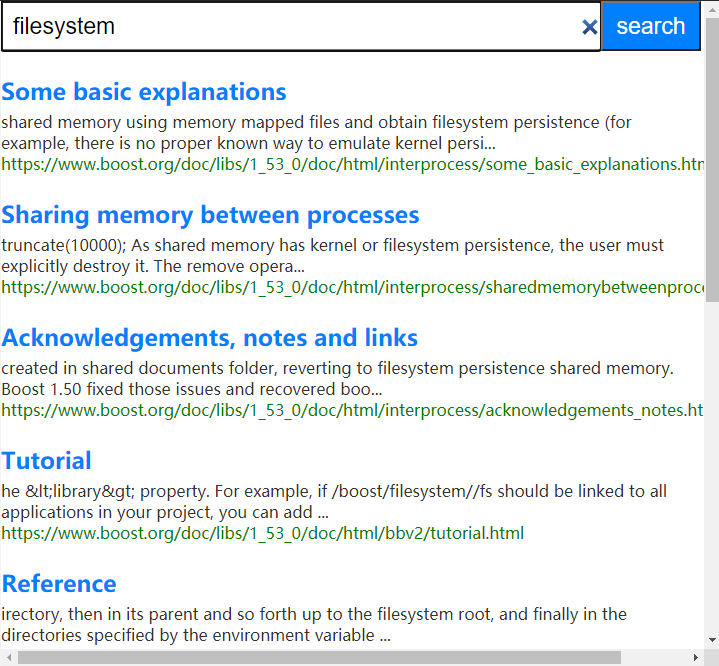

# 项目简介

实现boost文档的站内搜索，用户输入关键字，搜索引擎能快速检索出包含关键字的Boost文档的标题、URL及摘要，弥补了boost在线文档中没有搜索的缺陷

# 使用技术

cppjieba、httplib、jsoncpp、STL、boost

# 关键模块

预处理：对离线版本的HTML文档进行解析，并去除html标签，整理成行文本文件

索引：读取行文本文件，在内存中构建正排索引和倒排索引

搜索：对查询词进行分词，用分词结果在倒排索引中查寻文档id，并按权重排序，以Json格式进行包装后序列化为字符串返回

服务器：搭建HTTP服务器，为外部提供服务

# 代码介绍

首先，手动下载boost离线html文档，到data/input/中

* parser文件中预处理模块
  EnumFile: 输入路径data/input/，利用boost库中filesystem模块，通过一个迭代器来递归找到该目录下的所有文件，提取出所有html文档路径
  ParseFile: 读取html文档，解析出标题、本地路径对应的url、正文，并将信息组织成DocInfo结构体
  WriteOutput: 使用不可用字符作为分隔符，每个html文件为一行，存储在行文本文件data/tmp/raw_input中

* searcher文件中索引和搜索模块
  正排序索引：利用boost库中split函数切分行文本文件中的每一行，组织成DocInfo结构体（和ParseFile中DocInfo不同）增加了文档id，使用std::move放入vector中，文档id就是数组下标

  ```cpp
  // 正排索引，数组下标就对应到doc_id
  std::vector<DocInfo> forward_index; 
  
  // 文章信息
  struct DocInfo {
      int64_t doc_id; // 文档ID
      string title;   // 文档标题
      string url;     // 文档URL
      string content; // 文档正文
  };
  ```

  分词：读取正排索引中DocInfo结构体，用cppjieba分词库对每个文章标题、正文进行分词，分解成为一个一个的关键词，并统计每个单词的词频

  ```cpp
  // 统计词频结构体
  struct WordCnt {
      int title_cnt = 0;
      int content_cnt = 0;
  };
  std::unordered_map<std::string, WordCnt> word_cnt_map;
  ```

  倒排索引：遍历word_cnt_map，根据统计结果，整合出Weight对象，在倒排索引中找到倒排拉链，并把结果追加到倒排拉链末尾

  ```cpp
  // 倒排索引，使用一个hash表示映射关系
  std::unordered_map<std::string, InvertedList> inverted_index;
  // 权重信息
  struct Weight {
      int64_t doc_id; // 文档ID
      int weight;     // 权重 = 标题出现次数 * 10 + 正文出现次数
      string word;    // 关键词
  };
  typedef vector<Weight> InvertedList; // 倒排拉链
  ```

  搜索：对查询词进行分词，用分词结果在倒排索引中查倒排，并把倒排拉链合并在all_token_result中，并按权重排序，然后根据倒排拉链中的id查正排，获得标题，url，并且用GenerateDesc函数查找文章中第一次出现关键词的位置后获取前后部分内容构造文档描述，然后利用jsoncpp库以Json格式进行包装后序列化为字符串返回

* http_server服务器模块
  利用httplib库搭建http服务器，获取客户端请求中查询词，返回响应即可

# 效果演示


